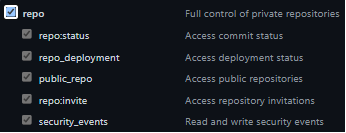

# wiki-automation
repo demo to update wiki

Prerequistes for using wiki on GitHub:

> Wikis are available in public repositories with GitHub Free and GitHub Free for organizations, and in public and private repositories with GitHub Pro, GitHub Team, GitHub Enterprise Cloud and GitHub Enterprise Server. For more information, see "GitHub's products."

## PAT Token

Follow the [github](https://docs.github.com/en/authentication/keeping-your-account-and-data-secure/creating-a-personal-access-token) instructions

Create a PAT with just enough permissions to push changes to repo



## Workflow to update

```yaml
    - name: Checkout base code
      uses: actions/checkout@v2
      with:
        path: base-code
    - name: Checkout wiki code
      uses: actions/checkout@v2
      with:
        repository: ${{github.repository}}.wiki
        path: markdown
    - name: Push to wiki
      run: |
        cd markdown
        git config --local user.email "action@github.com"
        git config --local user.name "GitHub Action"
        git add .
        git diff-index --quiet HEAD || git commit -m "Add changes" && git push
```