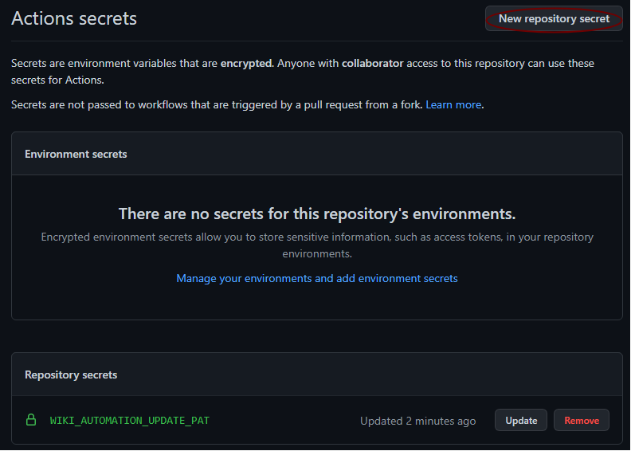

# wiki-automation
Repo demo to update wiki using workflow

Prerequistes for using wiki on GitHub:

> Wikis are available in public repositories with GitHub Free and GitHub Free for organizations, and in public and private repositories with GitHub Pro, GitHub Team, GitHub Enterprise Cloud and GitHub Enterprise Server. For more information, see "GitHub's products."

> Before starting you need to initiate the wiki... :unamused:

---
## PAT Token

Follow the [github](https://docs.github.com/en/authentication/keeping-your-account-and-data-secure/creating-a-personal-access-token) instructions

Create a PAT with just enough permissions to push changes to repo


---
## Create secret

The workflow needs a repositpry secret



---
## Workflow to update

The workflow will be triggered for any updates made in _docs/wiki_ when pushes are made to the main branch.
Make sure to create a repository secret.

```yaml
name: '.WIKI-AUTOMATION: Sync Docs/Wiki'

on:
  push:
    branches:
      - main
    paths:
      - 'docs/wiki/**'

env:
  wiki_source_repo: '${{ github.repository }}'
  wiki_source_repo_dir: '${{ github.repository }}/docs/wiki'
  wiki_target_repo: '${{ github.repository }}.wiki'
  github_commit_message: 'Wiki Sync from docs/wiki'
  pipelinePrincipalGitUserName: 'noreply' #Use a dummy email
  pipelinePrincipalGitUserEmail: 'noreply@ict-knowledge.net' # use a fake email to update

jobs:
  sync-wiki:
    name: Sync docs/wiki to Wiki
    runs-on: ubuntu-latest
    steps:
      - name: Checkout Source Repo
        uses: actions/checkout@v2
        with:
          repository: ${{ env.wiki_source_repo }}
          path: ${{ env.wiki_source_repo }}
          token: '${{ secrets.WIKI_AUTOMATION_UPDATE_PAT }}' # Sets general GIT credentials up

      - name: Checkout Wiki Repo
        uses: actions/checkout@v2
        with:
          repository: ${{ env.wiki_target_repo }}
          path: ${{ env.wiki_target_repo }}
          token: '${{ secrets.WIKI_AUTOMATION_UPDATE_PAT}}' # Sets general GIT credentials up

      - name: Configure Local Git
        run: |
          git config --global user.name '${{ env.pipelinePrincipalGitUserName }}'
          git config --global user.email '${{ env.pipelinePrincipalGitUserEmail }}'
        working-directory: ${{ env.GITHUB_WORKSPACE }}

      - name: Sync docs/wiki Into Wiki Repo
        shell: pwsh
        run: |
          rsync -avzr --delete --exclude='.git/' "${{ env.wiki_source_repo_dir }}/" "${{ env.wiki_target_repo }}"
        working-directory: ${{ env.GITHUB_WORKSPACE }}

      - name: Stage & Push Files Into Wiki Repo
        shell: pwsh
        run: |
          git add .
          git commit -m "$github_commit_message [$GITHUB_ACTOR/${GITHUB_SHA::8}]"
          git push
        working-directory: ${{ env.wiki_target_repo }}

```